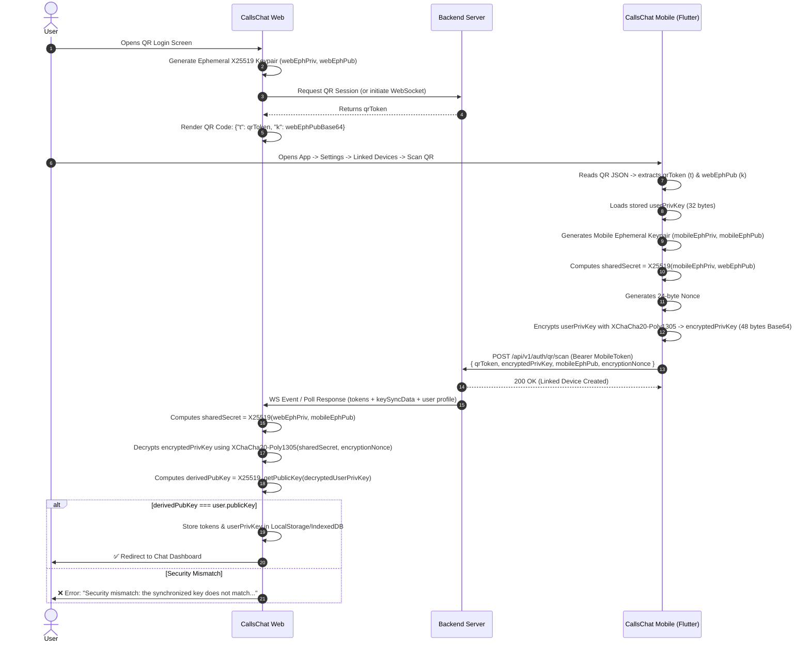

> **Document Version:** 1.0.0  
> **Target Audience:** Web Frontend Developers, Backend Engineers, Fullstack Teams  
> **Topic:** End-to-End Encryption (E2EE) & QR Code Authentication Flow between CallsChat Mobile (Flutter) and CallsChat Web (React/Next.js/Vue/JS)

---

## 1\. Executive Summary & Root Cause Analysis

### The Issue

When attempting QR Login on the Web App, the web developer encounters the error:

```text
Security mismatch: the synchronized key does not match your account. Login aborted.
```

### Why This Error Happens

1. **What the Security Check is doing:**  
  When the mobile app scans the web QR code, it encrypts the user's stored master **X25519 Private Key** and sends it to the web client via the backend. Once decrypted on the web browser, the web app derives the corresponding **Public Key** (`derivedPubKey`) from the decrypted private key and compares it against the user's registered public key (`accountPubKey` or backend public key):
  $$
  \\text{derivedPubKey} \\stackrel{?}{=} \\text{accountPubKey}
  $$
  If `derivedPubKey !== accountPubKey`, the web application aborts the login to prevent using corrupted or mismatched encryption keys.
2. **Common Root Causes for Mismatch:**
  - **Cipher Algorithm Mismatch:** Mobile uses `XChaCha20-Poly1305` with a **24-byte Nonce** (AEAD). If Web uses standard ChaCha20 (12-byte nonce) or AES-GCM, decryption produces corrupted bytes.
  - **Combined Ciphertext + MAC Tag Format:** Mobile concatenates the ciphertext (32 bytes) + Poly1305 MAC (16 bytes) into a single 48-byte buffer before Base64 encoding. Web must properly handle this 48-byte buffer.
  - **Key Derivation Difference (X25519 vs Ed25519):** CallsChat uses **X25519 (Curve25519 Diffie-Hellman)**, _not_ Ed25519 (digital signatures). The private key is exactly 32 bytes (scalar).
  - **Public Key Comparison Target:** Comparing with the wrong field (e.g. device ID instead of `publicKey`, or using Base64 with different padding/URL-safe encoding).
  - **Stale Keys in Backend:** The mobile app's local private key might not correspond to the public key currently stored on the backend for that user account.

---

## 2\. CallsChat Cryptography Specifications

|     |     |     |
| :--- | :--- | :--- |
| Parameter | Specification | Details |
| **Key Exchange (DH)** | **X25519** (Curve25519) | 32-byte private key scalar, 32-byte public key |
| **Symmetric Cipher** | **XChaCha20-Poly1305** | AEAD cipher with 192-bit (**24-byte**) random nonce |
| **MAC Tag Size** | **16 bytes** (Poly1305) | Appended to the end of ciphertext |
| **Encoding** | **Standard Base64** | `utf-8` strings encoded to/from Base64 (with `=` padding) |

---

## 3\. Full Step-by-Step Flow



---

## 4\. Mobile App Implementation Reference (Dart)

### 1\. Generating Encrypted Payload for Web (`qr_auth_service.dart`)

```dart
// Mobile reads its stored X25519 32-byte secret key
final userPrivBytes = base64Decode(userSecKeyBase64); // 32 bytes
final webEphPubBytes = base64Decode(webEphPubBase64); // 32 bytes

// 1. Generate mobile ephemeral X25519 keypair
final mobileEphKeyPair = await _x25519.newKeyPair();
final mobileEphPubKey = await mobileEphKeyPair.extractPublicKey();
final mobileEphPubBase64 = base64Encode(mobileEphPubKey.bytes);

// 2. Derive shared secret (32 bytes)
final sharedSecretKey = await _x25519.sharedSecretKey(
  keyPair: mobileEphKeyPair,
  remotePublicKey: SimplePublicKey(webEphPubBytes, type: KeyPairType.x25519),
);
final sharedSecretBytes = await sharedSecretKey.extractBytes();

// 3. Generate random 24-byte nonce
final nonceBytes = _cipher.newNonce(); // 24 bytes
final nonceBase64 = base64Encode(nonceBytes);

// 4. Encrypt user's private key bytes using XChaCha20-Poly1305
final secretBox = await _cipher.encrypt(
  userPrivBytes,
  secretKey: SecretKey(sharedSecretBytes),
  nonce: nonceBytes,
);

// Combined ciphertext: 32 bytes ciphertext + 16 bytes Poly1305 MAC tag = 48 bytes
final combinedCiphertext = base64Encode([...secretBox.cipherText, ...secretBox.mac.bytes]);

// 5. Sent to Backend via POST /api/v1/auth/qr/scan
final payload = {
  'qrToken': qrToken,
  'encryptedPrivKey': combinedCiphertext,
  'mobileEphPub': mobileEphPubBase64,
  'encryptionNonce': nonceBase64,
};
```

---

## 5\. Web Implementation Guide (JavaScript / TypeScript)

### Recommended Libraries

Install the following lightweight, audited cryptographic libraries:

```bash
npm install @noble/curves @noble/ciphers
```

_or using libsodium:_

```bash
npm install libsodium-wrappers
```

### Complete Working Web Implementation (`@noble/curves` + `@noble/ciphers`)

```typescript
import { x25519 } from '@noble/curves/ed25519';
import { xchacha20poly1305 } from '@noble/ciphers/chacha';
import { randomBytes } from '@noble/ciphers/webcrypto';

// ==========================================
// 1. Helper Encoding Utilities
// ==========================================
export function bytesToBase64(bytes: Uint8Array): string {
  let binary = '';
  const len = bytes.byteLength;
  for (let i = 0; i < len; i++) {
    binary += String.fromCharCode(bytes[i]);
  }
  return window.btoa(binary);
}

export function base64ToBytes(base64: string): Uint8Array {
  const binary = window.atob(base64.trim());
  const bytes = new Uint8Array(binary.length);
  for (let i = 0; i < binary.length; i++) {
    bytes[i] = binary.charCodeAt(i);
  }
  return bytes;
}

// ==========================================
// 2. Web Step 1: Generate Ephemeral Key & QR Payload
// ==========================================
export interface WebQrSession {
  webEphPriv: Uint8Array;
  webEphPubBase64: string;
  qrPayloadString: string;
}

export function generateWebQrPayload(qrToken: string): WebQrSession {
  // Generate 32-byte X25519 private key for Web ephemeral session
  const webEphPriv = x25519.utils.randomSecretKey();
  const webEphPub = x25519.getPublicKey(webEphPriv);
  const webEphPubBase64 = bytesToBase64(webEphPub);

  // The exact JSON structure scanned by CallsChat Mobile App:
  const qrPayload = {
    t: qrToken,
    k: webEphPubBase64,
  };

  return {
    webEphPriv,
    webEphPubBase64,
    qrPayloadString: JSON.stringify(qrPayload),
  };
}

// ==========================================
// 3. Web Step 2: Decrypt Master Key on Mobile Scan Confirmation
// ==========================================
export interface KeySyncData {
  encryptedPrivKey: string; // Base64 of 48-byte buffer (32B cipher + 16B MAC)
  mobileEphPub: string;     // Base64 of 32-byte mobile ephemeral pubkey
  encryptionNonce: string;  // Base64 of 24-byte nonce
}

export function decryptAndVerifyUserKey(
  webEphPriv: Uint8Array,
  syncData: KeySyncData,
  expectedAccountPublicKeyBase64: string
): { success: boolean; userPrivateKeyBase64?: string; error?: string } {
  try {
    const mobileEphPubBytes = base64ToBytes(syncData.mobileEphPub);
    const combinedEncryptedBytes = base64ToBytes(syncData.encryptedPrivKey);
    const nonceBytes = base64ToBytes(syncData.encryptionNonce);

    // Validate lengths
    if (mobileEphPubBytes.length !== 32) {
      return { success: false, error: 'Invalid mobile ephemeral public key length (must be 32 bytes).' };
    }
    if (nonceBytes.length !== 24) {
      return { success: false, error: 'Invalid nonce length (must be 24 bytes for XChaCha20).' };
    }
    if (combinedEncryptedBytes.length !== 48) {
      return { success: false, error: `Invalid encryptedPrivKey length (${combinedEncryptedBytes.length} bytes; expected 48 bytes).` };
    }

    // 1. Derive X25519 Shared Secret
    const sharedSecret = x25519.getSharedSecret(webEphPriv, mobileEphPubBytes);

    // 2. Decrypt using XChaCha20-Poly1305
    // @noble/ciphers expects (key, nonce) and decrypts combined (ciphertext + 16-byte tag)
    const cipher = xchacha20poly1305(sharedSecret, nonceBytes);
    const decryptedUserPrivKeyBytes = cipher.decrypt(combinedEncryptedBytes);

    if (decryptedUserPrivKeyBytes.length !== 32) {
      return { success: false, error: 'Decrypted private key must be 32 bytes.' };
    }

    // 3. Derive Public Key from the decrypted Private Key
    const derivedPubKeyBytes = x25519.getPublicKey(decryptedUserPrivKeyBytes);
    const derivedPubKeyBase64 = bytesToBase64(derivedPubKeyBytes);

    // 4. Security Check: Compare derived public key with account public key
    const cleanExpectedKey = expectedAccountPublicKeyBase64.trim();
    if (derivedPubKeyBase64 !== cleanExpectedKey) {
      console.error('[E2EE Security Mismatch]', {
        derived: derivedPubKeyBase64,
        expected: cleanExpectedKey,
      });
      return {
        success: false,
        error: 'Security mismatch: the synchronized key does not match your account. Login aborted.',
      };
    }

    // ✅ Verified successfully!
    return {
      success: true,
      userPrivateKeyBase64: bytesToBase64(decryptedUserPrivKeyBytes),
    };
  } catch (err: any) {
    console.error('[E2EE Decryption Failed]', err);
    return {
      success: false,
      error: `Decryption failed: ${err.message || err}`,
    };
  }
}
```

---

## 6\. Alternative Implementation using `libsodium-wrappers`

If the web project is already using `libsodium-wrappers`:

```typescript
import sodium from 'libsodium-wrappers';

export async function decryptAndVerifyWithSodium(
  webEphPriv: Uint8Array,
  syncData: KeySyncData,
  expectedAccountPublicKeyBase64: string
) {
  await sodium.ready;

  const mobileEphPub = sodium.from_base64(syncData.mobileEphPub);
  const nonce = sodium.from_base64(syncData.encryptionNonce);
  const combinedCiphertext = sodium.from_base64(syncData.encryptedPrivKey);

  // 1. Compute X25519 Shared Secret using crypto_scalarmult
  const sharedSecret = sodium.crypto_scalarmult(webEphPriv, mobileEphPub);

  // 2. Decrypt with XChaCha20-Poly1305
  // crypto_aead_xchacha20poly1305_ietf_decrypt expects combined ciphertext + tag
  const decryptedPrivKey = sodium.crypto_aead_xchacha20poly1305_ietf_decrypt(
    null, // secret message (null)
    combinedCiphertext,
    null, // additional data
    nonce,
    sharedSecret
  );

  // 3. Derive Public Key from Private Key (Scalar multiplication with base point)
  const derivedPubKey = sodium.crypto_scalarmult_base(decryptedPrivKey);
  const derivedPubKeyBase64 = sodium.to_base64(derivedPubKey);

  if (derivedPubKeyBase64 !== expectedAccountPublicKeyBase64.trim()) {
    throw new Error('Security mismatch: the synchronized key does not match your account. Login aborted.');
  }

  return sodium.to_base64(decryptedPrivKey);
}
```

---

## 7\. How Web Messages are Encrypted & Decrypted (1-to-1 Chat)

Once the master private key is synchronized and stored in `localStorage` or `IndexedDB`, Web encrypts/decrypts chat messages identically to Mobile:

### 1\. Deriving Shared Secret for a Peer User

```typescript
// 1. Fetch peer user's public key from GET /api/v1/encryption/keys/:peerUserId
const peerPubKeyBase64 = "..." // from backend
const peerPubKeyBytes = base64ToBytes(peerPubKeyBase64);
const myPrivKeyBytes = base64ToBytes(storedUserPrivateKeyBase64);

// 2. Compute shared secret
const chatSharedSecret = x25519.getSharedSecret(myPrivKeyBytes, peerPubKeyBytes);
```

### 2\. Encrypting an Outgoing Message

```typescript
export function encryptMessage(text: string, sharedSecret: Uint8Array) {
  const nonce = randomBytes(24); // 24-byte random nonce
  const plainBytes = new TextEncoder().encode(text);

  const cipher = xchacha20poly1305(sharedSecret, nonce);
  const combined = cipher.encrypt(plainBytes); // contains ciphertext + 16B MAC

  return {
    ciphertext: bytesToBase64(combined),
    nonce: bytesToBase64(nonce),
  };
}
```

### 3\. Decrypting an Incoming Message

```typescript
export function decryptMessage(
  ciphertextBase64: string,
  nonceBase64: string,
  sharedSecret: Uint8Array
): string {
  const combinedBytes = base64ToBytes(ciphertextBase64);
  const nonceBytes = base64ToBytes(nonceBase64);

  const cipher = xchacha20poly1305(sharedSecret, nonceBytes);
  const decryptedBytes = cipher.decrypt(combinedBytes);

  return new TextDecoder().decode(decryptedBytes);
}
```

---

## 8\. Common Troubleshooting Checklist for Web Developers

|     |     |     |
| :--- | :--- | :--- |
| Check | Issue | Resolution |
| 🔍 **Nonce length** | Using 12 bytes instead of 24 bytes | Ensure `XChaCha20` is used, which strictly requires a **24-byte** nonce. |
| 🔍 **Ciphertext format** | Ciphertext and MAC split | Mobile sends 48 bytes total (`32 bytes ciphertext + 16 bytes MAC`). Pass the full 48 bytes to `@noble/ciphers` or `libsodium`. |
| 🔍 **Public Key Source** | Comparing with wrong public key | Make sure `expectedAccountPublicKeyBase64` is fetched from `GET /api/v1/encryption/keys/:myUserId` or the `user.publicKey` returned by auth. |
| 🔍 **Curve Type** | Using Ed25519 instead of X25519 | Use `x25519.getPublicKey(...)` or `sodium.crypto_scalarmult_base(...)`. Do NOT use `ed25519.getPublicKey` (EdDSA). |
| 🔍 **Mobile Key Health** | Mobile reinstalled without key upload | Check if mobile uploaded its public key to `POST /api/v1/encryption/keys`. |
| 🔍 **QR Payload Format** | Malformed QR JSON | Ensure the Web QR code displays strictly `{"t":"<token>","k":"<base64>"}`. |

---

_For any additional questions, refer to_ `lib/features/auth/data/datasources/qr_auth_service.dart` _and_ `lib/core/encryption/encryption_service.dart` _in the Flutter mobile codebase._